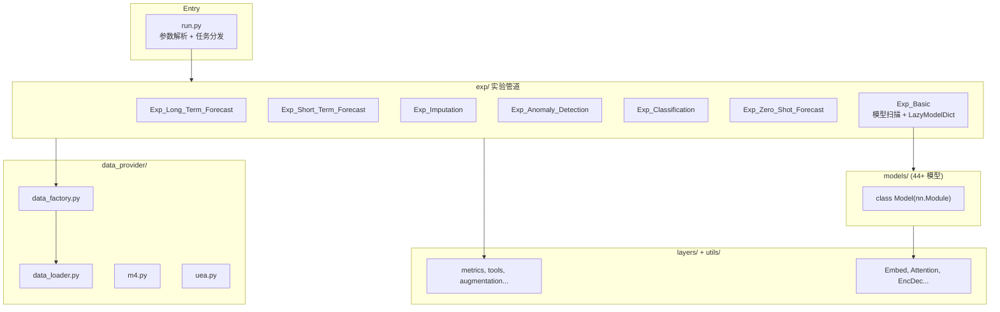

# Time-Series-Library（TSLib）代码仓库分析报告

> 生成日期：2026-05-15  
> 仓库路径：`/data/nishome/xuhaochen/Time-Series-Library`

---

## 一、项目定位与背景

**Time-Series-Library（TSLib）** 是清华大学 THUML 团队维护的**深度时间序列分析统一基准与代码库**，起源于 [Autoformer](https://github.com/thuml/Autoformer) 仓库，目标是：

- 在同一套数据接口、训练流程与评测指标下，公平对比数十种 SOTA 模型
- 支持从经典 Transformer 到 Mamba、Patch、频域、Koopman 等多种建模范式
- 覆盖预测、插补、异常检测、分类及零样本（LTSM）等任务

本仓库在官方 TSLib 基础上，还包含**本地实验扩展**（如 `APN.py`、`Koopa_z.py`、`weather_feature_autoresearch/`、`0notebook/` 等），用于 Weather 特征挖掘与模型调优。

### 1.1 支持的六大任务

| 任务 | `task_name` | 说明 |
|------|-------------|------|
| 长期预测 | `long_term_forecast` | ETT、Weather、Traffic 等，多步 ahead |
| 短期预测 | `short_term_forecast` | M4 竞赛数据集 |
| 缺失值填充 | `imputation` | 随机 mask 后重构 |
| 异常检测 | `anomaly_detection` | 重构误差 + 阈值 |
| 分类 | `classification` | UEA 时序分类 |
| 零样本预测 | `zero_shot_forecast` | Chronos、TimesFM 等 LTSM |

---

## 二、整体架构



### 2.1 核心设计原则

| 原则 | 实现方式 |
|------|----------|
| 统一入口 | `run.py` 通过 `--task_name` 选择 `Exp_*` 类 |
| 模型即插即用 | `Exp_Basic` 扫描 `models/*.py`，`LazyModelDict` 懒加载 |
| 统一模型接口 | 所有模型实现 `class Model`，`forward(x_enc, x_mark_enc, x_dec, x_mark_dec, mask=None)` |
| 任务内聚 | 每个 `Exp_*` 负责 train/vali/test 与指标写入 |

### 2.2 目录结构速查

```text
Time-Series-Library/
├── run.py                 # 唯一 CLI 入口
├── exp/                   # 6 类实验管道 + Exp_Basic
├── models/                # 44+ 模型（含 LTSM）
├── layers/                # 共享神经网络模块
├── data_provider/         # Dataset + DataLoader 工厂
├── utils/                 # 指标、训练工具、增强
├── scripts/               # 可复现实验 bash（277+ 脚本）
├── dataset/               # 本地数据（含 weather 扩展）
├── tutorial/              # TimesNet 教程 notebook
├── weather_feature_autoresearch/  # 本地特征挖掘流程
├── checkpoints/ results/ test_results/  # 运行产物
├── CLAUDE.md              # 开发指引
├── README_zh.md           # 中文说明
└── requirements.txt       # 依赖清单
```

---

## 三、入口层：`run.py`

### 3.1 职责

1. **固定随机种子**（2021）保证可复现
2. **定义全局超参**（约 160+ 个 CLI 参数）
3. **设备选择**：CUDA / MPS / CPU
4. **任务分发**到对应 `Exp` 类
5. **实验命名** `setting`：由 task、model_id、model、data、features、seq/label/pred_len、模型维度等拼接，用于 checkpoint 与结果目录

### 3.2 关键参数分组

| 分组 | 代表参数 | 含义 |
|------|----------|------|
| 任务 | `--task_name`, `--is_training` | 六种任务 + 训练/仅测试 |
| 数据 | `--data`, `--root_path`, `--data_path`, `--features` | 数据集类型与预测模式 |
| 窗口 | `--seq_len`, `--label_len`, `--pred_len` | 输入/起始 token/预测长度 |
| 模型结构 | `--enc_in`, `--dec_in`, `--c_out`, `--d_model`, `--e_layers`... | 各模型共用 |
| 优化 | `--train_epochs`, `--batch_size`, `--patience`, `--learning_rate` | Adam + EarlyStopping |
| 任务专用 | `--mask_rate`, `--anomaly_ratio`, `--seasonal_patterns` | 插补/异常/M4 |

### 3.3 预测模式 `features`

- **M**：多变量输入 → 多变量输出
- **S**：单变量 → 单变量（`--target` 指定列）
- **MS**：多变量输入 → 仅预测目标列（`f_dim=-1` 切片）

### 3.4 训练主循环

```text
for itr in range(args.itr):
    exp = Exp(args)
    exp.train(setting)   # 若 is_training=1
    exp.test(setting)    # 或 test(setting, test=1) 仅推理
```

---

## 四、实验管道层：`exp/`

所有实验类继承 `Exp_Basic`（`exp/exp_basic.py`）。

### 4.1 `Exp_Basic`：模型自动发现

- 扫描 `models/` 下所有 `.py`（除 `__init__.py`）
- `LazyModelDict`：首次访问 `--model` 名时 `importlib.import_module`
- 优先取 `module.Model`，否则取与文件名同名的类
- **新增模型**：在 `models/` 新建 `MyModel.py` 并实现 `class Model`，即可 `--model MyModel` 使用

### 4.2 长期预测 `Exp_Long_Term_Forecast`

**数据流（Encoder-Decoder 范式）：**

```text
batch_x      : [B, seq_len, C]     编码器输入
batch_y      : [B, label+pred, C]  含 label 段的真实未来（teacher forcing）
batch_x_mark / batch_y_mark : 时间特征

dec_inp = [batch_y[:, :label_len], zeros(pred_len)]  # 预测段用 0 占位

outputs = model(batch_x, batch_x_mark, dec_inp, batch_y_mark)
loss = MSE(outputs[:, -pred_len:], batch_y[:, -pred_len:])
```

**训练特性：**

- 优化器：Adam，损失：MSE
- EarlyStopping 监控 **验证集** loss
- 可选 AMP（`--use_amp`）
- 学习率调度：`adjust_learning_rate`（type1/2/3/cosine）
- 测试指标：MAE、MSE、RMSE、MAPE、MSPE，可选 DTW
- 结果：`./results/{setting}/`（npy）、`result_long_term_forecast.txt`（追加日志）

### 4.3 短期预测 `Exp_Short_Term_Forecast`

- 数据集：**M4**（`--data m4`）
- 自动设置：`pred_len = M4Meta.horizons_map[seasonal_patterns]`，`seq_len = 2 * pred_len`
- 损失：MSE / MAPE / MASE / SMAPE（`utils/losses.py`）
- 评测：`M4Summary` 汇总竞赛指标
- 前向常忽略时间标记：`model(batch_x, None, dec_inp, None)`

### 4.4 缺失值填充 `Exp_Imputation`

- 训练时对输入随机 mask（`mask_rate`，默认 25%）
- 损失仅在 **被 mask 位置** 计算 MSE
- `model(..., mask)` 传入 mask 供部分模型使用

### 4.5 异常检测 `Exp_Anomaly_Detection`

**两阶段无监督流程：**

1. **训练**：重构损失 `MSE(outputs, batch_x)`（自编码器式）
2. **测试**：
   - 在 train+test 重构误差上取百分位阈值（`anomaly_ratio`）
   - 测试集误差 > 阈值 → 异常
   - `adjustment()` 后处理对齐连续异常段
   - 指标：Accuracy、Precision、Recall、F-score

数据：PSM、MSL、SMAP、SMD、SWAT 等（滑动窗口 `win_size=seq_len`）。

### 4.6 分类 `Exp_Classification`

- 数据：**UEA** 时序分类（`.ts` 格式，`UEAloader`）
- 构建模型前动态设置：`seq_len = max_seq_len`，`enc_in = 特征数`，`num_class = 类别数`
- 输入：`(batch_x, label, padding_mask)`
- 优化器：**RAdam**（与其他任务不同）
- 损失：CrossEntropy，指标：准确率

### 4.7 零样本预测 `Exp_Zero_Shot_Forecast`

- **无 `train()`**，仅 `test()`
- 用于 Chronos、TimesFM、Moirai、Sundial 等 **预训练基础模型**
- 模型 `task_name == 'zero_shot_forecast'` 时走专用 forward 分支

---

## 五、数据层：`data_provider/`

### 5.1 `data_factory.py`

根据 `args.data` 映射到 Dataset 类，并构造 `DataLoader`：

| `args.data` | Dataset 类 | 典型任务 |
|-------------|------------|----------|
| ETTh1/2, ETTm1/2 | Dataset_ETT_hour/minute | 长期预测 |
| custom | Dataset_Custom | Weather、Traffic 等 |
| m4 | Dataset_M4 | 短期预测 |
| PSM/MSL/SMAP/SMD/SWAT | *SegLoader | 异常检测 |
| UEA | UEAloader | 分类 |

### 5.2 滑动窗口采样逻辑（预测类任务）

对索引 `index`：

```text
seq_x = data[index : index + seq_len]
seq_y = data[index + seq_len - label_len : index + seq_len + pred_len]
```

即 **seq_y 与 seq_x 在 label_len 区间重叠**，供 Decoder 的 teacher forcing。

### 5.3 数据集划分

| 数据集 | 划分方式 |
|--------|----------|
| ETT | 固定边界：12 月 train / 4 月 val / 4 月 test |
| Custom | 70% / 10% / 20%（train/val/test） |
| M4 | 按 seasonal pattern 子集 + 随机截断窗口 |
| 异常 | train 全量，val 为 train 后 20%，test 独立文件+标签 |

### 5.4 预处理

- **StandardScaler**：仅在训练段 `fit`，全序列 `transform`
- **时间编码**：`timeenc=0` 手工特征（月/日/周/时）；`timeenc=1` 用 `utils/timefeatures.py` 的 `timeF`
- **HuggingFace 回退**：本地无 CSV 时从 `thuml/Time-Series-Library` 拉取
- **数据增强**：`augmentation_ratio > 0` 时在训练集调用 `run_augmentation_single`

### 5.5 辅助模块

- **`m4.py`**：M4 元信息、horizon、频率映射
- **`uea.py`**：变长序列 padding、`collate_fn`、缺失值插补

---

## 六、模型层：`models/`（44 个实现）

### 6.1 统一接口约定

```python
class Model(nn.Module):
    def __init__(self, configs): ...
    def forward(self, x_enc, x_mark_enc, x_dec, x_mark_dec, mask=None):
        if self.task_name == 'long_term_forecast' or ...:
            return dec_out  # [B, L, C] 或分类时 [B, num_class]
```

多数模型按 `task_name` 分支实现 `forecast` / `imputation` / `anomaly_detection` / `classification`。

### 6.2 模型分类（按建模范式）

| 类别 | 代表模型 | 核心思想 |
|------|----------|----------|
| 线性/分解 | DLinear, TSMixer | 序列分解 + 线性映射，极简高效 |
| 标准 Transformer | Transformer, Informer, Reformer | Enc-Dec 注意力 |
| 分解+相关 | Autoformer, FEDformer, ETSformer | 趋势季节分解、频域、自相关 |
| Patch | PatchTST, TimeXer, MultiPatchFormer | 序列分 patch，降低复杂度 |
| 倒置维度 | iTransformer | 在 **变量维** 做注意力，时间维作 token |
| 2D/多尺度 | TimesNet, TimeMixer, MICN, WPMixer | FFT 周期、多尺度混合、小波 |
| 状态空间 | Mamba, MambaSingleLayer | 选择性状态空间，线性复杂度 |
| 图/消息 | MSGNet, TimeFilter | 变量间图结构 |
| 动力学 | Koopa | Koopman 算子学习 |
| 频域 | FreTS, FiLM | 傅里叶/勒让德记忆 |
| 预训练 LTSM | Chronos, Chronos2, TimesFM, Moirai, Sundial, TiRex, TimeMoE | 零样本，无梯度训练 |
| 本地扩展 | APN, Koopa_z | 用户自定义实验模型 |

### 6.3 三个代表性模型

#### DLinear（极简强基线）

- `series_decomp` 移动平均分解 → 季节/趋势各一条 `Linear(seq_len → pred_len)`
- 可选 `--individual` 每通道独立线性层

#### TimesNet（通用 SOTA 之一）

- FFT 找 top-k 周期 → 将 1D 序列 reshape 为 2D → Inception 卷积 → 加权融合
- 多任务头：预测 / 插补 / 异常 / 分类

#### iTransformer（长期预测 SOTA 之一）

- `DataEmbedding_inverted`：把 **每个变量** embed 成 token
- Encoder 在变量维 self-attention
- `projection`: `d_model → pred_len`，再反归一化（Non-stationary 风格）

#### Chronos（零样本）

- 加载 `amazon/chronos-bolt-base`
- 逐通道 `predict()`，无本地训练

---

## 七、公共组件层

### 7.1 `layers/`（16 个模块）

| 文件 | 作用 |
|------|------|
| `Embed.py` | Token/Positional/Temporal/DataEmbedding，及 inverted 变体 |
| `SelfAttention_Family.py` | FullAttention、ProbAttention 等 |
| `Transformer_EncDec.py` | 标准 Encoder/Decoder 层 |
| `Autoformer_EncDec.py` | 序列分解、AutoCorrelation |
| `AutoCorrelation.py` | 基于 FFT 的周期相关 |
| `FourierCorrelation.py` | FEDformer 频域块 |
| `Conv_Blocks.py` | Inception 等卷积块（TimesNet） |
| `DWT_Decomposition.py` | 小波分解（WPMixer 等） |
| `MambaBlock.py` | Mamba 封装 |
| `TimeFilter_layers.py` | TimeFilter 专用图滤波 |
| `Crossformer_EncDec.py` | Crossformer 专用 |
| `ETSformer_EncDec.py` | ETSformer 专用 |
| `Pyraformer_EncDec.py` | Pyraformer 专用 |
| `MultiWaveletCorrelation.py` | 小波相关 |
| `MSGBlock.py` | MSGNet 图块 |
| `StandardNorm.py` | 标准化模块 |

### 7.2 `utils/`

| 模块 | 功能 |
|------|------|
| `metrics.py` | MAE/MSE/RMSE/MAPE/MSPE |
| `tools.py` | EarlyStopping、学习率调整、可视化、异常 `adjustment` |
| `timefeatures.py` | `timeF` 连续时间特征 |
| `losses.py` | M4 的 MAPE/MASE/SMAPE |
| `augmentation.py` | 十余种时序增强（jitter、warp、DTW 等） |
| `dtw_metric.py` / `dtw.py` | 可选 DTW 评测 |
| `m4_summary.py` | M4 竞赛汇总 |
| `print_args.py` | 参数打印 |
| `masking.py` | 掩码工具 |
| `ADFtest.py` | 平稳性检验 |

---

## 八、脚本与复现：`scripts/`

- **277+ 个 `.sh` 脚本**，按任务与数据集组织：
  - `long_term_forecast/ETT_script/`、`Weather_script/`、`Traffic_script/`、`Exchange_script/`、`ILI_script/`
  - `short_term_forecast/*_M4.sh`
  - `imputation/`、`anomaly_detection/`、`classification/`
- 脚本本质：设置 `CUDA_VISIBLE_DEVICES` 并多次调用 `python run.py ...`
- 例：`DLinear_ETTh1.sh` 对 pred_len ∈ {96, 192, 336, 720} 各跑一遍

### 8.1 输出目录约定

| 路径 | 内容 |
|------|------|
| `./checkpoints/{setting}/checkpoint.pth` | 最优权重 |
| `./results/{setting}/*.npy` | pred/true/metrics |
| `./test_results/{setting}/*.pdf` | 预测曲线图 |
| `result_long_term_forecast.txt` | 长期预测指标日志 |
| `result_anomaly_detection.txt` | 异常检测指标日志 |

---

## 九、本地扩展（本工作区特有）

### 9.1 `weather_feature_autoresearch/`

在 Weather 长期预测上做**可审计的特征挖掘自动化**：

- Phase A：环境/分支/基线准备（`prepare.py`）
- Phase B：迭代 trial，结果写入 `results_all.tsv`、`baselines.json`
- 与 TSLib 的 `custom` + `weather.csv` 数据管线对接
- 须在 `tslib` conda 环境中运行

### 9.2 自定义模型与数据

- **`models/APN.py`**、`models/Koopa_z.py`：本地实验变体，配套 `scripts/long_term_forecast/APN_script/`
- **`dataset/weather/`**：含 LLM 衍生特征 CSV（`weather_llm_features.csv`、`weather_clean.csv` 等）
- **`scripts/generate_weather_llm_features.py`**：特征生成脚本

### 9.3 `0notebook/`

探索性 notebook（数据探索、实验记录），不参与主流程。

---

## 十、依赖与环境

### 10.1 环境配置

```bash
conda create -n tslib python=3.11
conda activate tslib
pip install torch==2.5.1 --index-url https://download.pytorch.org/whl/cu121
pip install -r requirements.txt
```

### 10.2 核心依赖（`requirements.txt`）

| 包 | 用途 |
|----|------|
| torch 2.5.1 | 深度学习框架 |
| numpy, pandas, scipy, scikit-learn | 数据处理 |
| matplotlib, sktime | 可视化与时序工具 |
| transformers, huggingface_hub, datasets | 数据与 LTSM |
| chronos-forecasting, timesfm, tirex-ts | 零样本模型 |
| gluonts, lightning, hydra-core | Moirai/uni2ts 生态 |
| einops, reformer-pytorch, local-attention | 模型组件 |
| PyWavelets | 小波（WPMixer 等） |

### 10.3 可选依赖

| 模型 | 额外依赖 | 说明 |
|------|----------|------|
| Mamba | `mamba_ssm` | 仅 Linux，需匹配 CUDA 的 wheel |
| Moirai | `uni2ts --no-deps` | 预训练基础模型 |

---

## 十一、扩展开发指南

### 11.1 添加新模型

1. 在 `models/NewModel.py` 实现 `class Model(nn.Module)`
2. `forward` 支持当前任务的 `task_name` 分支
3. 长期预测返回 `[B, pred_len, c_out]`（或完整序列再由 Exp 切片）
4. 运行：`python run.py --model NewModel ...`

### 11.2 添加新 CSV 数据集

1. 格式：`date` 列 + 多变量列，目标列名与 `--target` 一致
2. `--data custom --root_path ./dataset/xxx --data_path foo.csv`
3. 设置 `--enc_in/--dec_in/--c_out` 为变量数

### 11.3 典型长期预测命令

```bash
conda activate tslib
python -u run.py \
  --task_name long_term_forecast \
  --is_training 1 \
  --root_path ./dataset/ETT-small/ \
  --data_path ETTh1.csv \
  --model_id ETTh1_96_96 \
  --model iTransformer \
  --data ETTh1 \
  --features M \
  --seq_len 96 --label_len 48 --pred_len 96 \
  --enc_in 7 --dec_in 7 --c_out 7 \
  --train_epochs 10
```

### 11.4 使用脚本复现

```bash
bash ./scripts/long_term_forecast/ETT_script/DLinear_ETTh1.sh
bash ./scripts/long_term_forecast/Weather_script/iTransformer.sh
```

---

## 十二、架构优缺点总结

### 优点

- 高度模块化，新模型接入成本低
- 六类任务共享同一套模型实现，便于「通用时序模型」研究
- 脚本与论文基准对齐，社区广泛使用
- HuggingFace 数据集回退降低数据准备门槛
- LazyModelDict 避免一次性加载全部模型依赖

### 局限

- `run.py` 参数臃肿，部分参数仅特定模型使用
- Encoder-Decoder 接口对纯 Encoder 模型（DLinear、iTransformer）有冗余参数
- 分类/异常与预测的数据接口不统一，需在 `forward` 内适配
- LTSM 依赖重、环境敏感，与轻量实验分离成本高

---

## 十三、数据流总览（长期预测）

```text
CSV 数据
  ↓ Dataset_ETT_hour / Dataset_Custom
  ↓ StandardScaler (train fit) + time_features
  ↓ 滑动窗口 → (seq_x, seq_y, seq_x_mark, seq_y_mark)
  ↓ DataLoader
  ↓ Exp_Long_Term_Forecast.train()
  ↓ model(batch_x, batch_x_mark, dec_inp, batch_y_mark)
  ↓ MSE loss → EarlyStopping → checkpoint.pth
  ↓ Exp_Long_Term_Forecast.test()
  ↓ metric() → results/ + result_long_term_forecast.txt
```

---

## 十四、参考链接

- 官方仓库：https://github.com/thuml/Time-Series-Library
- 数据集：https://huggingface.co/datasets/thuml/Time-Series-Library
- 本地开发指引：`CLAUDE.md`
- 中文 README：`README_zh.md`

---

*本报告由代码静态分析生成，涵盖仓库核心模块与本地扩展。若模型或脚本有更新，请以实际代码为准。*
